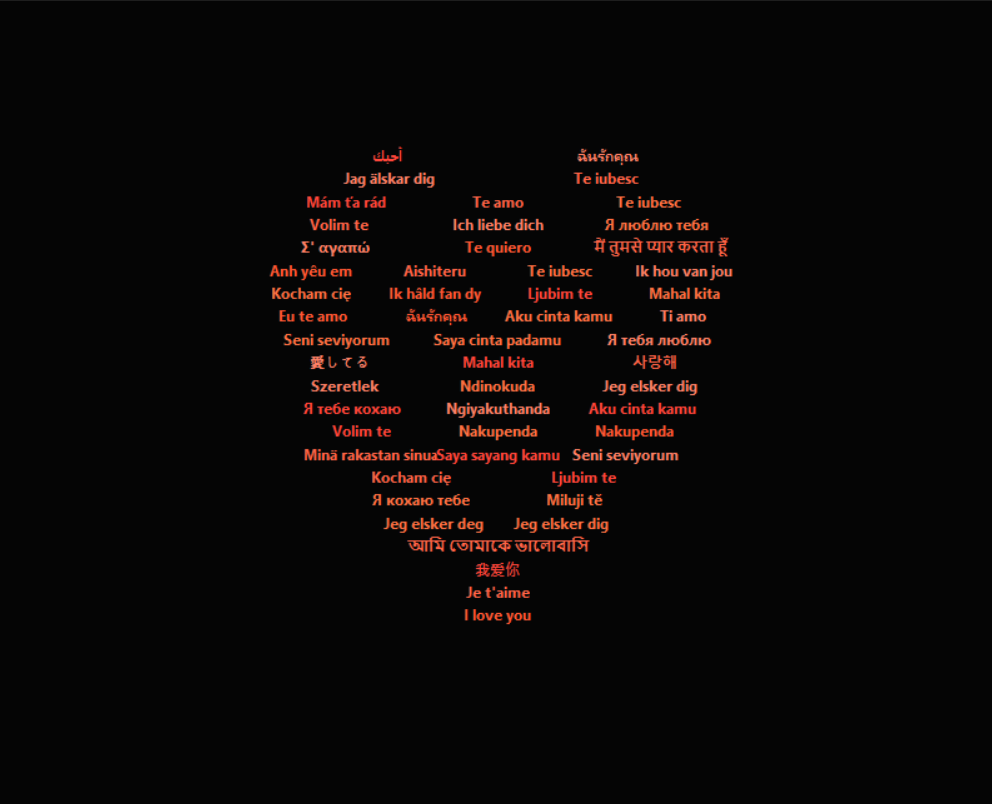

<div align="center">

# Love Heart ❤️

An animated Tkinter heart filled with “I love you” in many languages.

[](https://www.python.org/)
[](https://docs.python.org/3/library/tkinter.html)
[](LICENSE)

</div>

## About

Love Heart is a small Windows-friendly Python desktop project. It uses the
Tkinter standard library to reveal warm-colored multilingual phrases inside a
recognizable heart on a black background.

The project is intentionally simple: there are no third-party packages,
frameworks, build steps, or web services.

## Preview



The included image is a static preview. The live application gradually draws
the heart from its outside edge toward the center and then starts again.

## Features

- Animated outside-in heart reveal
- Smooth, non-blocking Tkinter animation
- Phrases using Latin, Cyrillic, Arabic, Indic, CJK, Korean, Greek, Hebrew,
  Armenian, Georgian, and other writing systems
- Warm red, orange, and pink text on a black background
- Reliable restart after each completed reveal
- Safe window-close handling that cancels pending callbacks
- No third-party dependencies

## Technologies

- Python 3
- Tkinter
- Python standard library only

## Requirements

- Windows with Python 3 installed
- Tkinter, normally included with the official Windows Python installer
- A font with the required Unicode glyphs for the best multilingual display

This project does not need a `requirements.txt` file because it only uses
Python's standard library.

## Run on Windows

Clone the repository and start the application:

```powershell
git clone https://github.com/0PKunal/iloveyouheart.git
cd iloveyouheart
py love_heart.py
```

If the `py` launcher is unavailable, use:

```powershell
python love_heart.py
```

No package installation command is needed.

## How it works

1. The program samples an implicit heart equation on a normalized coordinate
   grid.
2. Each scan line is split into separate segments so the gap between the
   upper lobes stays visible.
3. Spaced points are created for the phrases rather than packing text into
   every grid cell.
4. Points are sorted by their distance from the heart boundary. The animation
   draws boundary points first and inner points later.
5. `root.after()` schedules each frame without blocking Tkinter's event loop.

## Add or edit translations

Open `LOVE_PHRASES` in `love_heart.py` and add a quoted phrase followed by a
comma:

```python
LOVE_PHRASES = (
    "I love you",
    "Te amo",
    "Your translation here",
)
```

The program cycles through the list and reuses phrases when the heart has more
positions than translations.

## Customize the appearance

The configuration constants near the top of `love_heart.py` control the main
appearance:

| Constant | Purpose |
| --- | --- |
| `WINDOW_WIDTH`, `WINDOW_HEIGHT` | Window and canvas dimensions |
| `HEART_SCALE` | Overall heart size |
| `FONT_SIZE`, `FONT_WEIGHT` | Text styling |
| `TEXT_COLORS` | Phrase colors |
| `ANIMATION_DELAY_MS` | Delay between animation frames |
| `RESTART_DELAY_MS` | Pause before the next reveal |
| `TEXTS_PER_FRAME` | Number of phrases drawn per frame |

If you change the window dimensions, adjust `HEART_SCALE` as needed to keep
the heart centered and comfortably inside the canvas.

## Troubleshooting

### Tkinter cannot be imported

Use the official Python installer and ensure the Tcl/Tk option is selected.
On Linux, install the distribution's Tkinter package separately. This project
does not install system packages automatically.

### Some characters appear as boxes

Tkinter can only display glyphs provided by the selected operating-system
font. Install a font covering the missing script, or change the font selection
in `choose_font()`. Rendering quality varies by operating system and font;
the program cannot guarantee every script on every installation.

### The window does not appear

Run the command from a desktop session rather than a headless terminal or
remote environment. If Python reports an error, include the full traceback in
a bug report.

## Project structure

```text
love-heart/
├── .github/
│   └── ISSUE_TEMPLATE/
│       └── bug_report.md
├── .gitignore
├── LICENSE
├── README.md
├── love_heart.png
└── love_heart.py
```

## Contributing

Small improvements and accurate translations are welcome. Before opening an
issue or pull request:

1. Keep the project dependency-free.
2. Preserve the simple Tkinter design.
3. Run `python -m py_compile love_heart.py`.
4. Explain visual or behavior changes clearly.

## License

This project is released under the MIT License. See [LICENSE](LICENSE).

## Acknowledgments
- **GCC Compiler**: For compiling the C program.
- **Python Software Foundation**: For providing the Python programming language.
- **Visual Studio Code**: For being an excellent code editor.
- **Shields.io**: For the beautiful badges used in this README.

---
> **Note:** This README.md file was created with the help of AI. While every effort has been made to ensure accuracy and clarity, there may still be minor errors or inconsistencies. Users are encouraged to review the content carefully and make any necessary adjustments.

<div align="center">
  <p>Made with ❤️ by <a href="https://github.com/0PKunal">0PKunal</a></p>
  <p>If this project helped you, please give it a ⭐️</p>
</div>
